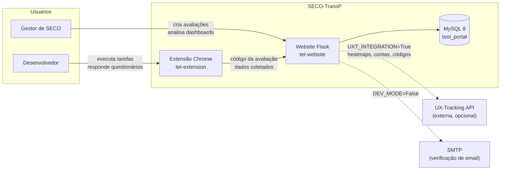

# SECO-TransP — Framework de Avaliação de Transparência para Ecossistemas de Software

O **SECO-TransP** é um framework para avaliar a **transparência de portais de ecossistemas de software** (SECO). Ele permite que gestores configurem avaliações baseadas em guidelines e critérios de sucesso, que desenvolvedores executem tarefas reais no portal através de uma extensão do Chrome (com coleta de navegação, feedback e questionários), e que os resultados sejam analisados em dashboards com KPIs, heatmaps, nuvens de palavras e gráficos de satisfação.

Desenvolvido no **LabESC (Laboratório de Engenharia de Sistemas Complexos) — UNIRIO**.

## Visão geral



As integrações tracejadas são **opcionais e controladas por flags** — o framework roda 100% local sem nenhuma dependência externa (veja [Flags de ambiente](#flags-de-ambiente)).

## Componentes

| Componente                 | Pasta                               | Descrição                                                                                                                                  |
| -------------------------- | ----------------------------------- | -------------------------------------------------------------------------------------------------------------------------------------------- |
| **Backend Flask**    | [`tet-website/`](tet-website/)     | Aplicação web (MVC) com API REST, autenticação, gestão de avaliações e dashboards analíticos server-rendered (Jinja2 + JS estático) |
| **Extensão Chrome** | [`tet-extension/`](tet-extension/) | Extensão Manifest V3 usada pelos desenvolvedores para executar as tarefas da avaliação, com tracking de navegação e questionários      |

## Início rápido

### Opção A — tudo no Docker (backend + banco)

```bash
cd tet-website && cp .env.example .env && cd ..
docker compose up -d --build
```

Pronto: MySQL 8 (porta 3307) e backend Flask (porta 5000) no ar, com migrations e seed automáticos e hot-reload do código. App em `http://localhost:5000`.

### Opção B — banco no Docker, Flask no venv (melhor para debug)

```bash
docker compose up -d db

cd tet-website
python -m venv venv
venv\Scripts\activate            # Windows (source venv/bin/activate no Linux/Mac)
pip install -r requirements.txt
cp .env.example .env

set FLASK_APP=index.py           # Windows (export no Linux/Mac)
flask db upgrade
flask seed

python index.py
```

Instruções detalhadas e troubleshooting: [`tet-website/README.md`](tet-website/README.md).

### Extensão Chrome

1. Acesse `chrome://extensions/` e ative o "Modo do desenvolvedor"
2. Clique em "Carregar sem compactação" e selecione a pasta `tet-extension/`
3. Para apontar a extensão pro backend local, veja [`tet-extension/README.md`](tet-extension/README.md)

## Flags de ambiente

Duas flags independentes no `.env` (lidas por [`tet-website/config_flags.py`](tet-website/config_flags.py)):

| Flag                | Default   | Efeito                                                                                                                                                                                                                                                                                      |
| ------------------- | --------- | ------------------------------------------------------------------------------------------------------------------------------------------------------------------------------------------------------------------------------------------------------------------------------------------- |
| `DEV_MODE`        | `False` | `True`: contas nascem verificadas (não precisa de SMTP). `False`: verificação por email obrigatória.                                                                                                                                                                                |
| `UXT_INTEGRATION` | `True`  | `True`: integra com a API externa do UX-Tracking (contas, heatmaps, códigos de avaliação). `False`: modo 100% local — signup/login não chamam a API, heatmaps mostram aviso de "integração desativada", reset de senha fica indisponível e os códigos são gerados localmente. |

| Combinação                                   | Uso típico                                                            |
| ---------------------------------------------- | ---------------------------------------------------------------------- |
| `DEV_MODE=True` + `UXT_INTEGRATION=False`  | **Desenvolvimento local completo** (zero dependências externas) |
| `DEV_MODE=True` + `UXT_INTEGRATION=True`   | Dev com heatmaps reais do UX-Tracking                                  |
| `DEV_MODE=False` + `UXT_INTEGRATION=True`  | **Produção**                                                   |
| `DEV_MODE=False` + `UXT_INTEGRATION=False` | Produção sem UX-Tracking (heatmaps desativados)                      |

## Fluxo de avaliação

1. **Configuração** — o gestor cadastra a avaliação, seleciona procedimentos (processos SECO) e distribui pesos entre os critérios de sucesso (KSC)
2. **Distribuição** — um código único é gerado e enviado aos desenvolvedores
3. **Execução** — o desenvolvedor insere o código na extensão, preenche o questionário de perfil e executa as tarefas no portal (com tracking de navegação)
4. **Feedback** — após cada tarefa, informa o status (resolvida / não conseguiu / não tem certeza) e comenta
5. **Revisão** — responde perguntas detalhadas sobre os critérios de sucesso (escala 0–100)
6. **Conclusão** — questionário final (satisfação 1–5 + comentários) e envio de todos os dados
7. **Análise** — o gestor explora o dashboard: KPIs por guideline, heatmaps, nuvens de palavras e gráficos

## Estrutura do repositório

```
SECO-Transparency-Framework/
├── docker-compose.yml          # MySQL 8 + backend Flask
├── docs/
│   └── ARCHITECTURE.md         # Documentação arquitetural (diagramas ER, sequência, rotas)
├── tet-website/                # Backend Flask (MVC)
│   ├── Dockerfile
│   ├── index.py                # Entry point
│   ├── config_flags.py         # Flags DEV_MODE / UXT_INTEGRATION
│   ├── commands.py             # CLI: flask seed
│   ├── seed_data.json          # Dados de referência (guidelines, processos, tarefas...)
│   ├── models/                 # ORM SQLAlchemy (17 entidades)
│   ├── views/                  # Rotas (index, auth, api, admin, pages)
│   ├── services/               # Heatmaps, cache, prefetch, email, tokens UXT
│   ├── external/               # Integração com a extensão (tasks.py)
│   ├── templates/              # Jinja2 (dashboards server-rendered)
│   ├── static/                 # CSS, JS, imagens
│   └── migrations/             # Alembic (baseline única)
└── tet-extension/              # Extensão Chrome (Manifest V3)
    ├── manifest.json
    ├── popup.js                # UI + fluxo da avaliação (CONFIG dev/prod no topo)
    └── background.js           # Tracking de navegação (tabs)
```

## Tecnologias

- **Backend:** Python 3.10+ (imagem Docker: 3.12), Flask 3.1, SQLAlchemy 2.0, Alembic/Flask-Migrate, bcrypt
- **Frontend:** Jinja2, JavaScript (ES6+), Chart.js, heatmap.js, WordCloud
- **Banco:** MySQL 8 (Docker)
- **Extensão:** JavaScript, Manifest V3 (side panel)
- **Infra:** Docker Compose (dev local com hot-reload)

## Documentação

- [`docs/ARCHITECTURE.md`](docs/ARCHITECTURE.md) — arquitetura, modelo de dados (ER), diagramas de sequência, inventário de rotas e decisões técnicas
- [`tet-website/README.md`](tet-website/README.md) — setup detalhado do backend, flags e troubleshooting
- [`tet-extension/README.md`](tet-extension/README.md) — instalação e configuração da extensão
- [`CLAUDE.md`](CLAUDE.md) — guia rápido para desenvolvimento assistido por IA

## Créditos

Projeto desenvolvido pelo **LabESC (Laboratório de Engenharia de Sistemas Complexos) da UNIRIO**, com contribuições de alunos de graduação, mestrado e doutorado.
