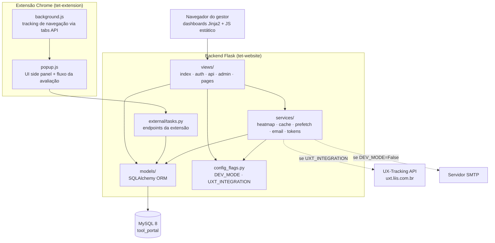
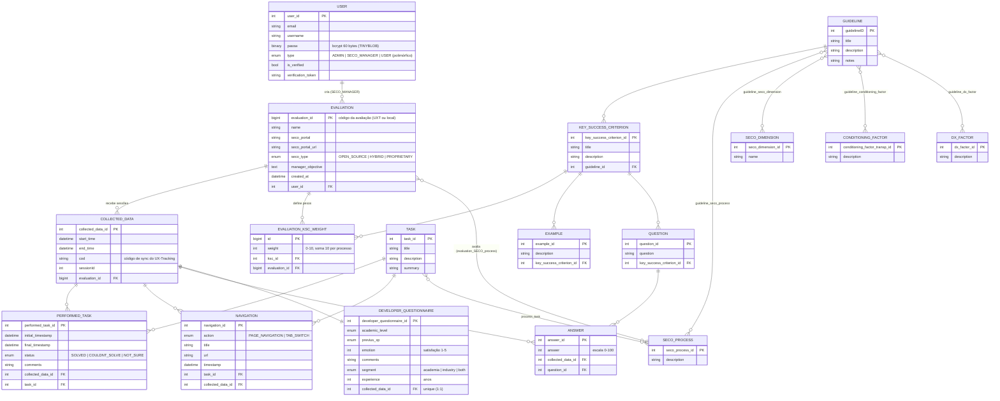
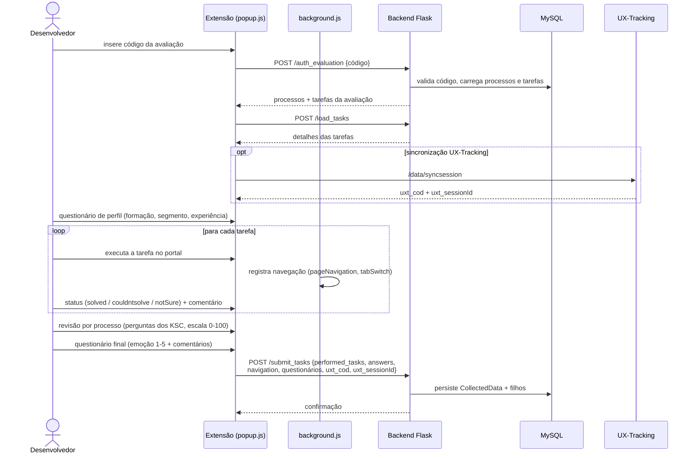
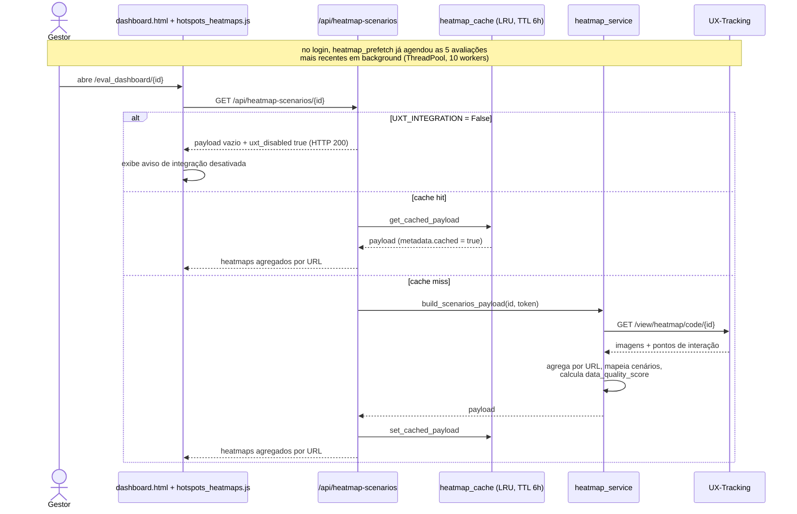
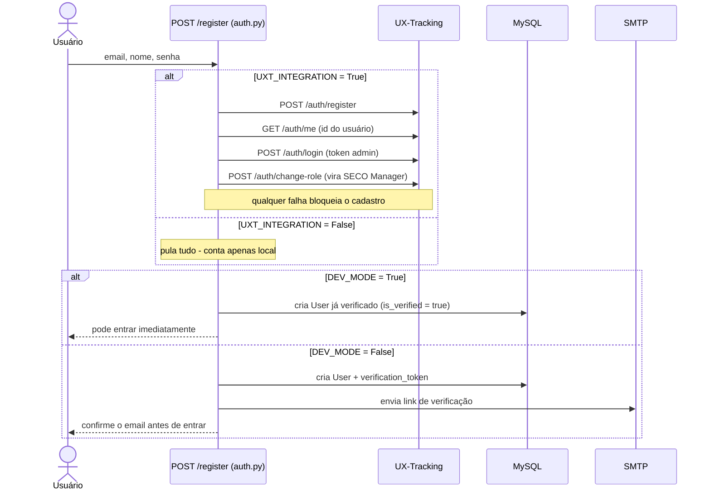

# Arquitetura — SECO-TransP

Documentação técnica do framework. Para visão geral e setup, veja o [README da raiz](../README.md) e o [README do backend](../tet-website/README.md).

## Sumário

- [Visão de componentes](#visão-de-componentes)
- [Backend (MVC)](#backend-mvc)
- [Modelo de dados (ER)](#modelo-de-dados-er)
- [Fluxos principais (diagramas de sequência)](#fluxos-principais)
- [Inventário de rotas](#inventário-de-rotas)
- [Camada de serviços](#camada-de-serviços)
- [Flags e modos de operação](#flags-e-modos-de-operação)
- [Decisões arquiteturais](#decisões-arquiteturais)

## Visão de componentes



Pontos-chave:

- **Sem SPA**: todos os dashboards são server-rendered (Jinja2) com JavaScript estático (`static/js/`). O antigo dashboard React foi removido por ser código morto.
- **`config_flags.py`** é a fonte única das flags — nenhum módulo lê `os.getenv` diretamente para `DEV_MODE`/`UXT_INTEGRATION`.
- A extensão conversa com o backend apenas por 3 endpoints (ver [fluxo da extensão](#1-fluxo-da-extensão-execução-de-uma-avaliação)).

## Backend (MVC)

| Camada | Pasta | Responsabilidade |
|--------|-------|------------------|
| Entry point | `index.py` | Cria o app Flask, inicializa SQLAlchemy/Migrate, importa views e models, registra CLI (`flask seed`), error handlers globais de banco |
| Views | `views/` + `external/tasks.py` | Rotas HTTP. Sem blueprints — cada módulo importa `app` de `index.py` e registra rotas com `@app.route` |
| Serviços | `services/` | Lógica de negócio reutilizável (heatmaps, cache, prefetch, email, tokens UXT) |
| Models | `models/` | ORM SQLAlchemy; todos exportados via `models/__init__.py` |
| Config | `database.py` (URI do banco) + `config_flags.py` (flags) | Configuração lida do `.env` |
| Auth helpers | `functions.py` | `isLogged()`, `isAdmin()`, decorator `login_required` |
| CLI | `commands.py` | `flask seed` — popula dados de referência de `seed_data.json` (idempotente) |

## Modelo de dados (ER)

17 tabelas de entidade + 7 associativas (24 no total). Visão por domínio:

**Domínio de referência** (populado pelo `flask seed`): guidelines, critérios de sucesso (KSC), exemplos, perguntas, processos SECO, dimensões, fatores condicionantes e de DX, tarefas.

**Domínio de avaliação** (criado pelos usuários): usuários, avaliações, pesos de KSC por avaliação e todos os dados coletados pela extensão.



Observações:

- `User` usa **herança polimórfica single-table**: `Admin` e `SECO_MANAGER` são subclasses discriminadas pela coluna `type`.
- A tabela `task_seco_type` (não mostrada no diagrama) associa cada `Task` aos tipos de SECO em que se aplica (`OPEN_SOURCE`/`HYBRID`/`PROPRIETARY`), com constraint de unicidade.
- `evaluation_id` é o **código distribuído aos desenvolvedores** — vem da API do UX-Tracking ou de geração local aleatória de 7 dígitos (fallback com detecção de colisão).

## Fluxos principais

### 1. Fluxo da extensão (execução de uma avaliação)



### 2. Fluxo de heatmap (dashboard do gestor)



### 3. Cadastro de conta nos dois modos



## Inventário de rotas

81 rotas no total. Autenticação: **L** = exige login, **A** = exige admin.

### `views/index.py` — avaliações e dashboards (10)

| Rota | Método | Descrição | Auth |
|------|--------|-----------|------|
| `/` | GET | Página inicial | — |
| `/evaluations` | GET | Lista avaliações do usuário (paginação, busca, ordenação) | L |
| `/evaluations/create_evaluation` | GET | Formulário de criação (gera CSRF token de sessão) | L |
| `/evaluations/create_evaluation/add_evaluation` | POST | Cria avaliação (valida CSRF, pesos KSC somando 10 por processo) | L |
| `/evaluations/<id>` | GET | Detalhe da avaliação com dados coletados | L |
| `/evaluations/<id>/edit` · `/update` · `/delete` | GET/POST | Edição e exclusão | L |
| `/eval_dashboard/<id>` | GET | Dashboard analítico da avaliação | L |
| `/view_heatmap/<id>` | GET | Página de visualização de heatmap | L |

### `views/auth.py` — autenticação (8)

| Rota | Método | Descrição | Auth |
|------|--------|-----------|------|
| `/signin` · `/auth` | GET/POST | Login (com token UXT opcional + prefetch de heatmaps) | — |
| `/signup` · `/register` | GET/POST | Cadastro (4 chamadas UXT quando integração ativa; conta local quando não) | — |
| `/verify/<token>` | GET | Verificação de email | — |
| `/logout` | GET | Encerra sessão | L |
| `/forgot-password` · `/reset-password/<id>` | GET/POST | Reset de senha via UXT (indisponível com `UXT_INTEGRATION=False`) | — |

### `views/api.py` — APIs de dados e heatmap (13)

| Rota | Descrição | Auth |
|------|-----------|------|
| `/api/heatmap-scenarios/<id>` | Heatmaps agregados por URL, com cache | L |
| `/api/heatmap-tasks/<id>` | Heatmaps segmentados por tarefa via navegação | L |
| `/api/view_heatmap/<id>` | Dados crus de heatmap do UXT | L |
| `/api/wordcloud/<id>` · `/api/wordcloud/task/<eid>/<tid>` | Frequência de palavras dos comentários (geral / por tarefa) | — |
| `/api/satisfaction/<id>` · `/api/experience-data/<id>` · `/api/grau-academico/<id>` · `/api/portal-familiarity/<id>` | Distribuições para os gráficos do dashboard | — |
| `/api/guideline/<id>` | Guideline em JSON com relacionamentos | — |
| `/api/get_pksc?ids=1,2` | KSCs por processo selecionado (alimenta o form de criação) | — |
| `/api/cache/stats` | Métricas do cache de heatmaps | L |

### `views/admin.py` — administração (38)

CRUD completo (add / edit / update / delete, todas **L+A**) para 8 recursos de referência:

| Recurso | Prefixo |
|---------|---------|
| Guidelines | `/admin/*_guideline` (+ painel em `/admin/guidelines`) |
| Processos SECO | `/admin/*_seco_process` |
| Dimensões SECO | `/admin/*_seco_dimension` |
| Fatores condicionantes | `/admin/*_conditioning_factor` |
| Fatores de DX | `/admin/*_dx_factor` |
| Critérios de sucesso (KSC) | `/admin/*_key_success_criterion` |
| Tarefas | `/admin/*_task` |
| Perguntas · Exemplos | `/admin/*_question` · `/admin/*_example` |

### `views/pages.py` — páginas públicas e utilitários (15)

| Rota | Descrição | Auth |
|------|-----------|------|
| `/doc` · `/about` · `/guidelines` | Páginas públicas | — |
| `/downloads` · `/download-extension` · `/download-uxtracking` | Download dos ZIPs das extensões | — |
| `/seco_dashboard` · `/dashboardv2` | Dashboards alternativos | L / — |
| `/heatmap-tasks/<id>` | Página de heatmaps por tarefa | L |
| `/api/ping` · `/api/check-tables` | Health checks | — |
| `/teste` · `/test-navigation` · `/api/evaluation-data` | Páginas/endpoints de teste | — |

### `external/tasks.py` — integração com a extensão (5)

| Rota | Método | Descrição |
|------|--------|-----------|
| `/auth_evaluation` | POST | Valida o código e retorna processos + tarefas |
| `/load_tasks` | POST | Carrega detalhes das tarefas |
| `/submit_tasks` | POST | Recebe o pacote completo da avaliação (tarefas, respostas, navegação, questionários) |
| `/get_data/<evaluation_id>` | GET | Consulta dados coletados |
| `/data_collected` | GET | Página de dados coletados |

## Camada de serviços

**`heatmap_service.py`** — transforma os dados crus da API do UX-Tracking em payloads de visualização: normaliza timestamps, mapeia eventos de navegação para tarefas por intervalo de tempo (`build_navigation_task_map`), agrega heatmaps por URL (`build_scenarios_payload`) e segmenta por tarefa (`segment_heatmaps_by_tasks`). Calcula um `data_quality_score` com warnings quando faltam imagens ou navegação.

**`heatmap_cache.py`** — cache LRU em memória com TTL de 6 horas e capacidade para 50 avaliações. Evita chamadas repetidas à API do UXT (que pode levar minutos para datasets grandes). Expõe `get_cache_stats()` em `/api/cache/stats`.

**`heatmap_prefetch.py`** — pré-busca assíncrona via `ThreadPoolExecutor` (10 workers). Disparada no login e na listagem de avaliações para as 5 avaliações mais recentes, deixando o dashboard quente antes do gestor abrir. Sai silenciosamente quando não há token UXT.

**`email_service.py`** — envio SMTP de emails transacionais (verificação de conta e reset de senha). Não-bloqueante: falha de envio não impede a criação da conta.

**`uxt_token_manager.py`** — gestão de tokens da API do UX-Tracking em dois níveis: token de sessão (do login do usuário) e token de serviço compartilhado (credenciais de serviço/admin), com cache, expiração com buffer de 60s e refresh automático. Com `UXT_INTEGRATION=False`, retorna `None` imediatamente sem nenhuma chamada externa.

## Flags e modos de operação

As flags são lidas **uma única vez** em `config_flags.py` (sem imports do app — zero risco de import circular) e importadas por views e serviços:

```python
from config_flags import DEV_MODE, UXT_INTEGRATION
```

| | `UXT_INTEGRATION=True` | `UXT_INTEGRATION=False` |
|---|---|---|
| **Cadastro** | 4 chamadas à API UXT antes da conta local (falha bloqueia) | Conta local direta |
| **Login** | Obtém token UXT (tolera falha) + prefetch de heatmaps | Pula chamada e prefetch |
| **Heatmaps** | Busca real na API UXT com cache | HTTP 200 com `uxt_disabled: true`; UI mostra aviso |
| **Reset de senha** | Fluxo via UXT | Indisponível (mensagem amigável) |
| **Código de avaliação** | Gerado pela API UXT (fallback local se falhar) | Gerado localmente (7 dígitos, anticolisão) |

`DEV_MODE` controla apenas a **verificação de email**: `True` → conta nasce verificada e não exige SMTP; `False` → fluxo de verificação completo. As quatro combinações de flags são válidas.

O startup loga o estado: `Startup flags: DEV_MODE=... | UXT_INTEGRATION=...`

## Decisões arquiteturais

**Baseline Alembic única.** O histórico de migrations foi consolidado na baseline `4ef2e61f029a` (cria as 24 tabelas), validada contra um banco limpo: `flask db upgrade` + `flask db check` sem drift. Bancos criados com a cadeia antiga precisam de `flask db stamp 4ef2e61f029a` (após conferir o schema). O schema é propriedade exclusiva do Alembic — `db.create_all()` é proibido.

**Seed idempotente.** `flask seed` pode rodar em todo start do container: tabelas simples checam existência por PK antes de inserir; associativas usam `INSERT IGNORE`. Por isso o compose roda `flask db upgrade && flask seed` no comando de inicialização do backend.

**Branches `main` × `dev`.** Os históricos são **não relacionados** (sem merge-base — o repositório foi recriado em algum ponto). Todo o conteúdo da `main` (snapshot de produção, nov/2025) existe na `dev` em versão mais recente, verificado por patch-equivalência. Promover `dev` → `main` exige `git push origin dev:main --force`; nunca tente merge comum.

**Mesma `.env` para Docker e venv.** No compose, `environment: SERVER: db:3306` sobrescreve o `env_file`; como `load_dotenv()` não sobrescreve variáveis já definidas, o mesmo arquivo `.env` serve para o container (rede interna) e para o venv no host (`localhost:3307`).

**CSRF em formulário crítico.** A criação de avaliação usa token de uso único salvo na sessão (`eval_form_token`), validado e consumido no POST.

**Segurança de sessão.** Cookies `HttpOnly` + `SameSite=Lax`, sessão com timeout de 24h, senhas com bcrypt (custo padrão, hash de 60 bytes em `TINYBLOB`).
