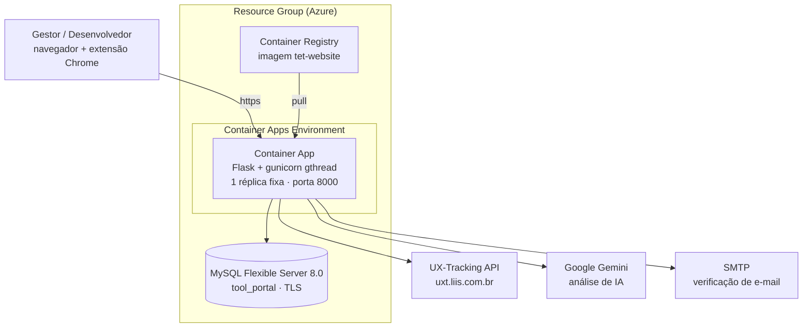

# Deploy na Azure — SECO-TransP

Plano de preparação e deploy do portal em **Azure Container Apps**, com **Azure Container Registry** e **Azure Database for MySQL Flexible Server**. Para a arquitetura da aplicação, veja [ARCHITECTURE.md](ARCHITECTURE.md); para setup local, o [README da raiz](../README.md).

## Sumário

- [Por que sair do serverless](#por-que-sair-do-serverless)
- [Por que Container Apps](#por-que-container-apps)
- [Arquitetura de deploy](#arquitetura-de-deploy)
- [Fase 0 — Correções de código](#fase-0--correções-de-código)
- [Fase 1 — Container de produção](#fase-1--container-de-produção)
- [Fase 2 — Extensão Chrome](#fase-2--extensão-chrome)
- [Provisionamento](#provisionamento)
- [Verificação](#verificação)
- [Estimativa de custo](#estimativa-de-custo)
- [Fora do escopo](#fora-do-escopo)

## Por que sair do serverless

O portal rodou no Vercel numa avaliação real com desenvolvedores e o fluxo de coleta funcionava — ele é request/response simples e serverless atende bem. O que mudou depois foi a **camada de análise de IA**, incompatível com serverless por design:

1. **O trabalho acontece depois da resposta HTTP.** `POST /api/ai-analysis/<id>/generate` chama `pipeline.schedule()`, que faz `_executor.submit(_run, ...)` e retorna `202` imediatamente (`services/ai/pipeline.py:91-92`). Em serverless a execução é congelada quando o handler retorna: a thread não termina, a avaliação fica `RUNNING` e após 10 minutos o `STALE_AFTER` marca **ERROR**. Sempre, não intermitentemente.

2. **Tornar síncrono não resolve.** São duas chamadas LLM em sequência (`pipeline.py:220` e `:239`), cada uma com `AI_TIMEOUT_S=180` e 4 tentativas com backoff 2s/4s/8s sobre uma cadeia de 3 modelos (`services/ai/provider.py:131-148`). O `.env.example:68` registra "~66s no estudo real" apenas na etapa 1. O limite do Vercel Pro é 60s.

Há ainda dois pontos menores que dependem de processo vivo: o cache de heatmap em RAM com TTL de 6h (`services/heatmap_cache.py`) e o prefetch disparado no login (`views/auth.py:67-77`).

## Por que Container Apps

Com **conta Azure for Students** (US$100 de crédito, sem cartão), o App Service **Premium v3 não está disponível** — restam F1/D1/série B, e o B1 (1,75 GB) é arriscado para o cache de heatmap.

| | Web App for Containers | **Container Apps** |
|---|---|---|
| Cota gratuita | Não | **180.000 vCPU-s + 360.000 GiB-s/mês, permanente** |
| RAM acessível | B1 = 1,75 GB | 1–2 GiB sem saltar de tier |
| Configuração | `WEBSITES_PORT`, Always On, `acrUseManagedIdentityCreds` | Porta e registry são campos diretos |
| Scale-to-zero | Não | Sim (mas **não usar aqui**) |

> **Restrição obrigatória: `--min-replicas 1 --max-replicas 1`.**
> `min=1` porque scale-to-zero mataria o cache de heatmap e descartaria análises de IA em andamento.
> `max=1` porque com 2+ réplicas os globals de `views/auth.py:16-19` divergem entre réplicas, duas rodariam `flask db upgrade` simultaneamente (o Alembic não tem lock distribuído) e o cache duplicaria na RAM.

## Arquitetura de deploy



**Decisões:** manter Gemini como provedor de IA; migrations no entrypoint do container; provisionamento e deploy manuais (sem CI/CD); corrigir apenas o essencial de segurança — os 73 usos de `global` em `views/admin.py` e `views/auth.py` permanecem, mitigados pela réplica única.

## Fase 0 — Correções de código

### 1. `tet-website/database.py` — URI, TLS e pool

- **Remover `SECRET_KEY` daqui.** A linha 7 (`os.getenv('SECRET_KEY')`, sem default) sobrescreve o valor de `index.py:17` via `from_pyfile`, virando `None` se a variável faltar.
- `urllib.parse.quote_plus` no usuário e na senha — senhas geradas pelo Azure contêm `@`, `/` e `:`, que quebram o parser de URL.
- `SQLALCHEMY_ENGINE_OPTIONS`: `pool_pre_ping=True` (o MySQL gerenciado derruba conexões ociosas; sem isso vêm os erros 2006 que os handlers de `index.py:75-100` hoje mascaram como 503), `pool_recycle=240`, `pool_size=5`, `max_overflow=10`.
- TLS via `connect_args`, controlado por `DB_SSL_REQUIRED` — o Azure MySQL tem `require_secure_transport=ON`.

### 2. `tet-website/index.py` — ProxyFix, SECRET_KEY, FLASK_ENV

- **`ProxyFix`**: `app.wsgi_app = ProxyFix(app.wsgi_app, x_for=1, x_proto=1, x_host=1)`. Sem isso, `url_for(..., _external=True)` em `views/auth.py:197` gera o link de verificação de e-mail em `http://` com host errado, e o cadastro quebra.
- Mover `from_pyfile('database.py')` para **antes** da definição de `SECRET_KEY`.
- `SECRET_KEY` ausente em produção passa a levantar `RuntimeError` em vez de usar o fallback `"dev-secret"` — que é um valor público neste repositório, e o cookie de sessão carrega o JWT da UXT (`services/uxt_service.py:154`).
- `FLASK_ENV` com default `"production"`: hoje a ausência da variável desliga `SESSION_COOKIE_SECURE` silenciosamente.

### 3. `tet-website/external/tasks.py:15` — CORS restrito

`CORS(app)` libera `Access-Control-Allow-Origin: *` para o app inteiro, incluindo `/admin/*` e `/auth`. Restringir às três rotas usadas pela extensão (`popup.js:663,698,1219`): `/auth_evaluation`, `/load_tasks`, `/submit_tasks`.

### 4. `tet-website/services/email_service.py:49` — timeout no SMTP

`smtplib.SMTP()` sem `timeout` herda o default do socket (`None`, infinito) e roda de forma síncrona dentro do registro (`views/auth.py:198`). Adicionar `timeout` (`SMTP_TIMEOUT_S`, default 20) e usar `with smtplib.SMTP(...) as server:` — o `server.quit()` da linha 54 é pulado em qualquer exceção, vazando socket.

### 5. Limites de memória configuráveis

- `services/heatmap_cache.py:9`: `MAX_CACHE_SIZE` → `int(os.getenv("HEATMAP_CACHE_MAX", "8"))`. Cada entrada guarda o payload com uma imagem JPEG em base64 por página única da avaliação.
- `services/heatmap_prefetch.py:13`: `max_workers` → `int(os.getenv("HEATMAP_PREFETCH_WORKERS", "3"))`. Hoje são 10 threads disparadas no login, cada uma podendo montar um payload grande em memória.

## Fase 1 — Container de produção

### 6. `tet-website/requirements.txt`

Acrescentar `gunicorn==23.0.0` — não há servidor WSGI nas dependências hoje.

### 7. `tet-website/Dockerfile`

Substitui o `CMD ["flask", "run", ..., "--debug"]` atual, que expõe o console do Werkzeug (execução remota de código) na internet.

- `python:3.12-slim` + `curl` para o healthcheck. Sem multi-stage: todas as wheels são binárias para cp312.
- Usuário não-root (`appuser`, uid 10001).
- `ENV PORT=8000`, `EXPOSE 8000`, `GUNICORN_WORKERS=1`, `GUNICORN_THREADS=6`, `GUNICORN_TIMEOUT=300`.
- `ENTRYPOINT ["/app/entrypoint.sh"]`.

**Worker `gthread`, `-w 1 --threads 6`:** `sync` prenderia um processo inteiro por 120s em cada heatmap. Múltiplos workers multiplicariam os `ThreadPoolExecutor` (prefetch e IA) e o cache. Um worker mantém um cache, um pool de prefetch e um conjunto de globals — é o que contorna o estado global sem tocar em 73 linhas. `--timeout 300` é obrigatório: o default de 30s mataria todo heatmap (a UXT usa `timeout=120`) e toda análise de IA.

### 8. `tet-website/entrypoint.sh` (novo)

1. Valida as variáveis obrigatórias, falhando com mensagem legível.
2. Espera o banco aceitar conexão (retry ~90s).
3. `flask db upgrade` + `flask seed` — ambos idempotentes; a cadeia de migrations é linear, com head único.
4. `exec gunicorn ...` — o `exec` faz o gunicorn virar PID 1 e receber o `SIGTERM` para shutdown gracioso.

A flag `RUN_MIGRATIONS_ON_START` (default `true`) permite desligar depois sem rebuild. Isso é seguro **porque a réplica é única**.

> **Windows:** o arquivo precisa de line endings **LF**. Adicionar `entrypoint.sh text eol=lf` ao `.gitattributes`, senão o container falha com `exec format error`.

### 9. `.dockerignore` e `.env.example`

- `.dockerignore`: acrescentar `.git/`, `docs/`, `vercel.json`, `**/__pycache__/`, `.venv/`, `*.log`. O contexto cai de ~180 MB para ~75 MB. O ZIP de 63 MB permanece — `/download-extension` depende dele (`views/pages.py:37`).
- `.env.example`: documentar `FLASK_ENV`, `DB_SSL_REQUIRED`, `SMTP_TIMEOUT_S`, `RUN_MIGRATIONS_ON_START`, `GUNICORN_*`, `HEATMAP_CACHE_MAX`, `HEATMAP_PREFETCH_WORKERS`.

### 10. `docker-compose.yml`

Manter o fluxo local: `FLASK_ENV=development` e `command:` sobrescrito com `flask run --debug` para preservar o hot-reload (o bind mount já mascara o `COPY`).

## Fase 2 — Extensão Chrome

`tet-extension/popup.js:11-17` está com `isDevelopment: true` (aponta para `127.0.0.1:5000`) e `PRODUCTION_URL` no Vercel legado. Corrigir para `isDevelopment: false`, apontar para a URL do Container App e normalizar a barra final no getter (`base.replace(/\/+$/, "")`), já que os call sites concatenam `${API_BASE_URL}/rota`. Subir a versão em `manifest.json` (`0.0.1` → `0.1.0`), senão o Chrome não atualiza.

O ZIP em `static/downloads/` precisa ser regerado com o `popup.js` corrigido — caso contrário o download entrega a versão apontando para localhost.

## Provisionamento

**Recursos:** Resource Group · Container Registry (Basic) · MySQL Flexible Server 8.0 · Container Apps Environment + Container App.

**MySQL:** `Standard_B1ms`, versão **8.0** — paridade com o compose, já que as migrations usam `mysql.VARCHAR` com collation (`migrations/versions/1141a64c9458_*.py`) e o seed usa `INSERT IGNORE` (`commands.py:30`). Ajustar `wait_timeout=600` e charset `utf8mb4`. Firewall: liberar "Azure services" ou usar VNet.

**Container App:**
- CPU `0.5`, memória `1Gi` (com `HEATMAP_CACHE_MAX=8`). Se houver OOM, subir para `1.0` / `2Gi`.
- `--min-replicas 1 --max-replicas 1` — ver a restrição acima.
- Ingress externo na porta **8000**.
- Health probe em `/api/ping` (`views/pages.py:95-97`). A rota já existe e **não toca o banco**, que é o comportamento correto: um probe que falhasse por indisponibilidade do MySQL reciclaria a réplica em loop sem resolver nada.

**Variáveis:** `FLASK_ENV=production`, `FLASK_APP=index.py`, `PORT=8000`, `GUNICORN_WORKERS=1`, `SGBD=mysql+mysqlconnector`, `SERVER=<srv>.mysql.database.azure.com:3306`, `DATABASE`, `DB_USER`, `DB_SSL_REQUIRED=true`, `DEV_MODE=False`, `UXT_INTEGRATION=True`, `AI_ANALYSIS=True`, `AI_PROVIDER=gemini`, `AI_TIMEOUT_S=180`, `HEATMAP_CACHE_MAX=8`, `HEATMAP_PREFETCH_WORKERS=3`, `SMTP_*`.

**Como secrets** (`--secrets` + `secretref:`): `SECRET_KEY`, `PASSW`, `SENDER_PASSWORD`, `ADMIN_PASSWORD`, `GEMINI_API_KEY`.

> `UXT_INTEGRATION` tem default **`True`** quando ausente — configure explicitamente.
> `ADMIN_EMAIL` / `ADMIN_PASSWORD` é a conta **SUPERVISOR da UXT**, não o admin do portal: sem ela o cadastro de gestor falha.

## Verificação

1. **Build e smoke local:**
   ```bash
   docker compose up -d db
   docker build -t tet-website:prod ./tet-website
   docker run --rm -p 8000:8000 --env-file tet-website/.env \
     -e SERVER=host.docker.internal:3307 -e FLASK_ENV=production \
     -e SECRET_KEY=<gerado> tet-website:prod
   ```
   Nos logs: validação de variáveis → banco alcançável → `db upgrade` → `seed` → gunicorn. Confirmar que o aviso "This is a development server" sumiu.
2. `curl http://localhost:8000/api/ping` → `{"status":"ok",...}`.
3. `docker run --rm tet-website:prod id` → uid 10001 (não-root).
4. **Roteiro manual** — não há suíte de testes no repositório, então esta é a única rede de proteção:
   - Login.
   - Cadastro: verificar que o link de verificação sai como `https://` (valida o ProxyFix).
   - Dashboard com heatmap.
   - **Gerar uma análise de IA e confirmar que chega a `DONE`** — é o motivo da migração.
   - `/download-extension`: valida que o Git LFS foi resolvido e o ZIP não é um ponteiro de texto (ver `.gitattributes`).
5. Após o deploy: `az containerapp logs show --follow` no primeiro start, e acompanhar a memória durante a primeira análise de IA e o primeiro heatmap para calibrar `HEATMAP_CACHE_MAX`.

## Estimativa de custo

Região `brazilsouth`, réplica única contínua (0,5 vCPU / 1 GiB).

| Recurso | Configuração | Custo/mês (USD) |
|---|---|---|
| Container Apps | 0,5 vCPU + 1 GiB, 1 réplica 24/7 | **~$15–20** (após a cota gratuita) |
| MySQL Flexible Server | B1ms (1 vCore, 2 GiB) + 32 GB | **~$25–30** |
| Container Registry | Basic, 10 GB | **~$5** |
| Rede (saída) | Baixo volume | **~$1–3** |
| **Total** | | **~$46–58/mês** |

A cota gratuita permanente do Container Apps (180.000 vCPU-s + 360.000 GiB-s por mês) cobre cerca de **metade** de uma réplica de 0,5 vCPU rodando o mês inteiro, o que já está refletido na faixa acima.

**Com Azure for Students (US$100 de crédito):** aproximadamente **2 meses** de operação contínua.

Para estender o crédito:
- **Parar o Container App fora dos períodos de avaliação** — é o maior item variável. Só isso pode dobrar a duração do crédito.
- **Reserved capacity de 1 ano no MySQL** reduz o banco em ~30–40%, mas exige compromisso.
- **Deletar o ACR após o deploy** e reconstruir quando necessário (~$5/mês economizados, ao custo de conveniência).

O custo da API do Gemini é separado e não entra no crédito Azure: com `gemini-3.6-flash`, uma análise consome as duas etapas do pipeline e fica na casa de centavos por avaliação.

## Fora do escopo

Registrado para depois: globals → `flash()` (pré-requisito para escalar horizontalmente), ZIPs para Blob Storage, cache de heatmap em Redis, e-mail assíncrono, `print()` → `app.logger`, CI/CD, remoção de dependências não usadas (`pillow`, `Flask-Caching`, `pymemcache`) e do `vercel.json` órfão, e uma suíte mínima de testes.
