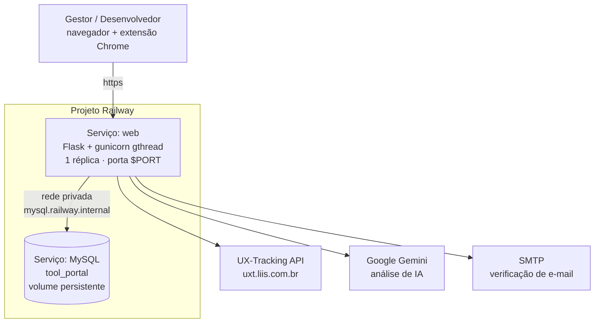

# Deploy no Railway — SECO-TransP

Plano de preparação e deploy do portal no **Railway**, com o app Flask e o MySQL no mesmo projeto, ligados por rede privada. Para a arquitetura da aplicação, veja [ARCHITECTURE.md](ARCHITECTURE.md); para o setup local, o [README da raiz](../README.md). A alternativa em Azure está em [DEPLOY_AZURE.md](DEPLOY_AZURE.md).

## Sumário

- [Por que Railway](#por-que-railway)
- [Arquitetura de deploy](#arquitetura-de-deploy)
- [Fase 0 — Correções de código](#fase-0--correções-de-código)
- [Fase 1 — Container e configuração](#fase-1--container-e-configuração)
- [Fase 2 — Extensão Chrome](#fase-2--extensão-chrome)
- [Provisionamento](#provisionamento)
- [Verificação](#verificação)
- [Custo](#custo)
- [Riscos conhecidos](#riscos-conhecidos)

## Por que Railway

O portal rodou no Vercel numa avaliação real e o fluxo de coleta funcionava. O que quebrou depois foi a **camada de IA**, incompatível com serverless: `pipeline.schedule()` faz `_executor.submit(_run, ...)` e retorna `202` imediatamente (`services/ai/pipeline.py:91-92`) — em serverless a execução congela quando o handler retorna, a thread não termina e a avaliação fica `RUNNING` até o `STALE_AFTER` de 10 min marcá-la como **ERROR**. Tornar síncrono também não caberia: são duas chamadas LLM em sequência (`pipeline.py:220` e `:239`), cada uma com `AI_TIMEOUT_S=180` e 4 tentativas com backoff sobre 3 modelos (`services/ai/provider.py:131-148`).

Dois critérios decidiram a plataforma — duração máxima de request e existência de MySQL:

| | **Railway** | Render | Azure Container Apps |
|---|---|---|---|
| Timeout HTTP | **15 min** (5 min ocioso) | ~15–30s | Sem limite prático |
| MySQL gerenciado | **Sim**, 1 clique | Não (só PostgreSQL) | Sim |
| Rede privada app↔banco | **Sim**, nativa | Sim | Sim (VNet) |
| Custo estimado | **~$10–20/mês** | ~$14+, sem MySQL | ~$46–58/mês |

O Render sai por dois motivos: não tem MySQL gerenciado — migrar para PostgreSQL exigiria reescrever as migrations que usam `mysql.VARCHAR` com collation (`migrations/versions/1141a64c9458_*.py`) e o `INSERT IGNORE` do seed (`commands.py:30`) — e o timeout curto quebraria o dashboard de heatmap, cuja chamada à UXT tem `timeout=120`.

O Railway resolve os três problemas de uma vez: os 15 minutos cobrem heatmap e IA com folga, o MySQL fica no mesmo projeto (sem firewall nem IP dinâmico) e o billing por segundo mantém o custo baixo com uso leve.

> **Réplica única.** Manter 1 réplica. Com duas ou mais, os globais de `views/auth.py:16-19` divergem entre instâncias (mensagem de erro de um usuário aparecendo para outro, ou sumindo), e o cache de heatmap em RAM duplica. São 73 usos de `global` em `views/admin.py` e `views/auth.py`; corrigi-los está fora do escopo deste plano.

## Arquitetura de deploy



**Decisões:** Gemini como provedor de IA (o logo OpenAI no diagrama original é ilustrativo); migrations via `preDeployCommand`; deploy automático a partir do GitHub; correções apenas do essencial de segurança.

## Fase 0 — Correções de código

Independem da plataforma — valem igual no Railway ou na Azure.

### 1. `tet-website/database.py` — URI, TLS e pool

- **Remover `SECRET_KEY` daqui.** A linha 7 (`os.getenv('SECRET_KEY')`, sem default) sobrescreve o valor de `index.py:17` via `from_pyfile`, virando `None` se a variável faltar.
- `urllib.parse.quote_plus` no usuário e na senha — a senha gerada pelo Railway pode conter `@`, `/` ou `:`, que quebram o parser de URL do SQLAlchemy.
- `SQLALCHEMY_ENGINE_OPTIONS`: `pool_pre_ping=True` (o MySQL derruba conexões ociosas por `wait_timeout`; sem isso vêm os erros 2006 que os handlers de `index.py:75-100` hoje mascaram como 503), `pool_recycle=240`, `pool_size=5`, `max_overflow=10`.
- TLS opcional via `DB_SSL_REQUIRED`: na rede privada do Railway o tráfego já vai encriptado por WireGuard, então **TLS no MySQL não é necessário** — deixar `false`. A opção fica no código para o caso de um banco externo.

### 2. `tet-website/index.py` — ProxyFix, SECRET_KEY, FLASK_ENV

- **`ProxyFix`**: `app.wsgi_app = ProxyFix(app.wsgi_app, x_for=1, x_proto=1, x_host=1)`. O Railway termina TLS no edge e encaminha por HTTP; sem isso `url_for(..., _external=True)` em `views/auth.py:197` gera o link de verificação de e-mail em `http://` com host errado, e o cadastro quebra.
- Mover `from_pyfile('database.py')` para **antes** da definição de `SECRET_KEY`.
- `SECRET_KEY` ausente em produção passa a levantar `RuntimeError` em vez de cair no fallback `"dev-secret"` — valor público neste repositório, e o cookie de sessão carrega o JWT da UXT (`services/uxt_service.py:154`).
- `FLASK_ENV` com default `"production"`: hoje a ausência da variável desliga `SESSION_COOKIE_SECURE` silenciosamente.

### 3. `tet-website/external/tasks.py:15` — CORS restrito

`CORS(app)` libera `Access-Control-Allow-Origin: *` para o app inteiro, incluindo `/admin/*` e `/auth`. Restringir às três rotas usadas pela extensão (`popup.js:663,698,1219`): `/auth_evaluation`, `/load_tasks`, `/submit_tasks`.

### 4. `tet-website/services/email_service.py:49` — timeout no SMTP

`smtplib.SMTP()` sem `timeout` herda o default do socket (`None`, infinito) e roda síncrono dentro do registro (`views/auth.py:198`). Adicionar `timeout` (`SMTP_TIMEOUT_S`, default 20) e usar `with smtplib.SMTP(...) as server:` — o `server.quit()` da linha 54 é pulado em qualquer exceção, vazando socket.

### 5. Limites de memória configuráveis

A RAM é cobrada por uso no Railway (~$10/GB-mês), então isso afeta a conta diretamente.

- `services/heatmap_cache.py:9`: `MAX_CACHE_SIZE` → `int(os.getenv("HEATMAP_CACHE_MAX", "8"))`. Cada entrada guarda o payload com uma imagem JPEG em base64 por página única da avaliação.
- `services/heatmap_prefetch.py:13`: `max_workers` → `int(os.getenv("HEATMAP_PREFETCH_WORKERS", "3"))`. Hoje são 10 threads disparadas no login, cada uma podendo montar um payload grande em memória.

## Fase 1 — Container e configuração

### 6. `tet-website/requirements.txt`

Acrescentar `gunicorn==23.0.0` — não há servidor WSGI nas dependências.

### 7. `tet-website/Dockerfile`

Substitui o `CMD ["flask", "run", ..., "--debug"]` atual, que expõe o console do Werkzeug (execução remota de código) na internet.

- `python:3.12-slim`. Usuário não-root (`appuser`, uid 10001).
- **`CMD` em shell form** — o Railway injeta `PORT` apenas em runtime, e a exec form (JSON array) não expande variáveis:
  ```dockerfile
  CMD exec gunicorn --bind "0.0.0.0:${PORT:-8000}" \
        --workers 1 --threads 6 --worker-class gthread \
        --timeout 300 --graceful-timeout 30 \
        --access-logfile - --error-logfile - index:app
  ```

**Worker `gthread`, `-w 1 --threads 6`:** `sync` prenderia o processo por 120s em cada heatmap. Múltiplos workers multiplicariam os `ThreadPoolExecutor` (prefetch e IA) e o cache, e fariam os globais divergirem. `--timeout 300` é obrigatório: o default de 30s mataria todo heatmap e toda análise de IA.

O `exec` faz o gunicorn virar PID 1 e receber o `SIGTERM` do Railway para shutdown gracioso.

**Sem entrypoint.sh.** As migrations vão no `preDeployCommand` (item 8), que é melhor: roda **antes** do deploy ficar ativo, e se falhar o deploy não prossegue — o app nunca sobe contra um schema desatualizado. Isso também evita o problema de line endings CRLF que um `.sh` traria no Windows.

### 8. `tet-website/railway.json` (novo)

```json
{
  "$schema": "https://railway.com/railway.schema.json",
  "build": { "builder": "DOCKERFILE" },
  "deploy": {
    "preDeployCommand": "flask db upgrade && flask seed",
    "healthcheckPath": "/api/ping",
    "healthcheckTimeout": 300,
    "restartPolicyType": "ON_FAILURE",
    "restartPolicyMaxRetries": 3
  }
}
```

- `preDeployCommand` roda na rede privada com acesso às variáveis do serviço. `flask db upgrade` e `flask seed` são idempotentes (a cadeia de migrations é linear, com head único), então repetir a cada deploy é seguro.
- `healthcheckPath` usa `/api/ping` (`views/pages.py:95-97`), que já existe e **não toca o banco** — o comportamento correto: um probe que falhasse por indisponibilidade do MySQL reciclaria o container em loop sem resolver nada.
- O arquivo fica em `tet-website/` porque o **Root Directory** do serviço será `tet-website` (item Provisionamento).

### 9. `.dockerignore`

Acrescentar `.git/`, `docs/`, `vercel.json`, `**/__pycache__/`, `.venv/`, `*.log` ao `tet-website/.dockerignore`. O contexto cai de ~180 MB para ~75 MB, o que acelera cada build. O ZIP de 63 MB permanece — `/download-extension` depende dele (`views/pages.py:37`).

### 10. `.env.example`

Documentar as variáveis novas: `FLASK_ENV`, `DB_SSL_REQUIRED`, `SMTP_TIMEOUT_S`, `HEATMAP_CACHE_MAX`, `HEATMAP_PREFETCH_WORKERS`.

## Fase 2 — Extensão Chrome

`tet-extension/popup.js:11-17` está com `isDevelopment: true` (aponta para `127.0.0.1:5000`) e `PRODUCTION_URL` no Vercel legado. Corrigir para `isDevelopment: false`, apontar para o domínio do Railway e normalizar a barra final no getter (`base.replace(/\/+$/, "")`), já que os call sites concatenam `${API_BASE_URL}/rota`. Subir a versão em `manifest.json` (`0.0.1` → `0.1.0`), senão o Chrome não atualiza.

O ZIP em `static/downloads/` precisa ser regerado com o `popup.js` corrigido — caso contrário o download entrega a versão apontando para localhost.

## Provisionamento

**1. Criar o projeto e o banco.** No dashboard do Railway: novo projeto → *Add MySQL*. O serviço sobe com volume persistente e expõe as variáveis `MYSQLHOST`, `MYSQLPORT`, `MYSQLUSER`, `MYSQLPASSWORD`, `MYSQLDATABASE` e `MYSQL_URL`.

**2. Criar o serviço web.** *Add Service* → *GitHub Repo* → este repositório. Em **Settings**:
- **Root Directory**: `tet-website` (é onde estão o `Dockerfile` e o `railway.json`).
- **Branch**: `main`.
- Builder é detectado como Dockerfile automaticamente.

**3. Variáveis do serviço web.** O código monta a URI a partir de variáveis próprias (`database.py:16-23`), então usar **reference variables** apontando para o serviço MySQL — assim a senha nunca é copiada à mão e o tráfego fica na rede privada:

```
SGBD=mysql+mysqlconnector
SERVER=${{MySQL.RAILWAY_PRIVATE_DOMAIN}}:${{MySQL.MYSQLPORT}}
DB_USER=${{MySQL.MYSQLUSER}}
PASSW=${{MySQL.MYSQLPASSWORD}}
DATABASE=${{MySQL.MYSQLDATABASE}}
DB_SSL_REQUIRED=false

FLASK_ENV=production
FLASK_APP=index.py
SECRET_KEY=<gerar: python -c "import secrets;print(secrets.token_urlsafe(64))">

DEV_MODE=False
UXT_INTEGRATION=True
ADMIN_EMAIL=<conta SUPERVISOR da UXT>
ADMIN_PASSWORD=<senha>

AI_ANALYSIS=True
AI_PROVIDER=gemini
AI_MODEL=gemini-3.6-flash
AI_FALLBACK_MODELS=gemini-3.5-flash,gemini-2.5-flash
AI_TIMEOUT_S=180
AI_ALLOW_REGENERATE=False
GEMINI_API_KEY=<chave>

HEATMAP_CACHE_MAX=8
HEATMAP_PREFETCH_WORKERS=3

SMTP_SERVER=smtp.gmail.com
SMTP_PORT=587
SMTP_TIMEOUT_S=20
SENDER_EMAIL=<remetente>
SENDER_PASSWORD=<app password>
```

> `UXT_INTEGRATION` tem default **`True`** quando ausente — configure explicitamente.
> `ADMIN_EMAIL` / `ADMIN_PASSWORD` é a conta **SUPERVISOR da UXT**, não o admin do portal: sem ela o cadastro de gestor falha.
> Não definir `PORT` — o Railway injeta.

**4. Gerar o domínio.** Em *Settings → Networking → Generate Domain*. O Railway detecta a porta pelo bind do processo.

**5. Migrar os dados existentes** (se quiser preservar a avaliação real que está no MySQL da AWS):
```bash
mysqldump -h <host-aws> -u <user> -p tool_portal > dump.sql
mysql -h <MYSQLHOST> -P <MYSQLPORT> -u <MYSQLUSER> -p <MYSQLDATABASE> < dump.sql
```
Rodar **antes** do primeiro deploy; o `flask db upgrade` do `preDeployCommand` então aplica só o que faltar.

## Verificação

1. **Build e smoke local** (Docker disponível na máquina):
   ```bash
   docker compose up -d db
   docker build -t tet-website:prod ./tet-website
   docker run --rm -p 8000:8000 --env-file tet-website/.env \
     -e SERVER=host.docker.internal:3307 -e FLASK_ENV=production \
     -e SECRET_KEY=<gerado> -e PORT=8000 tet-website:prod
   ```
   Confirmar que o aviso "This is a development server" sumiu e que o gunicorn subiu.
2. `curl http://localhost:8000/api/ping` → `{"status":"ok",...}`.
3. `docker run --rm tet-website:prod id` → uid 10001 (não-root).
4. **No Railway, após o deploy** — não há suíte de testes no repositório, então este roteiro é a única rede de proteção:
   - Nos logs do build: `preDeployCommand` executou `db upgrade` e `seed` sem erro.
   - Login.
   - Cadastro: o link de verificação sai como `https://` (valida o ProxyFix).
   - Dashboard com heatmap (valida que os 120s da UXT cabem no timeout).
   - **Gerar uma análise de IA e confirmar que chega a `DONE`** — é o motivo da migração.
   - `/download-extension`: valida que o Git LFS foi resolvido e o ZIP não é um ponteiro de texto (ver `.gitattributes`).
5. Acompanhar a aba **Metrics** do serviço na primeira análise de IA e no primeiro heatmap para calibrar `HEATMAP_CACHE_MAX` — a RAM é cobrada por uso.

## Custo

Railway cobra por segundo, sobre uso real: RAM ~$10/GB-mês, vCPU ~$20/vCPU-mês, volume $0,25/GB-mês, egress $0,05/GB.

| Item | Estimativa/mês |
|---|---|
| Plano Hobby (mínimo, inclui $5 de crédito) | $5 |
| App web (~0,5 GB RAM médio, CPU baixa) | ~$5–8 |
| MySQL (~0,3 GB RAM + 5 GB volume) | ~$4–6 |
| Egress | ~$1 |
| **Total** | **~$10–20** |

Os $5 do plano Hobby já cobrem parte do consumo — a conta só passa disso quando o uso ultrapassa o crédito. Contra ~$46–58/mês na Azure.

O **Trial** ($5, 30 dias, sem cartão) serve para validar o deploy antes de assinar, mas tem teto de 1 GB de RAM e remove volumes após a expiração — não usar para dados reais.

O custo da API do Gemini é separado: com `gemini-3.6-flash`, uma análise consome as duas etapas do pipeline e fica na casa de centavos por avaliação.

## Riscos conhecidos

**Banco não gerenciado.** A documentação do Railway é explícita: os templates de banco são *unmanaged services* — **backup e recuperação são responsabilidade sua**. Não há snapshot automático como no RDS ou no Azure. Para dados de avaliação real, configurar um `mysqldump` periódico (um serviço com `cronSchedule` no próprio Railway resolve) antes de considerar a migração concluída.

**Sem réplicas.** Ver a nota em [Por que Railway](#por-que-railway). Se algum dia precisar escalar, os globais de `views/auth.py` e o cache em RAM precisam ser resolvidos antes.

**Rede privada só em runtime.** Não está disponível durante o build — o que não afeta este plano, já que o `preDeployCommand` roda depois do build, com acesso à rede privada.

**Cold start do DNS privado.** A documentação não garante o tempo até o DNS interno resolver no start do container. Se o `preDeployCommand` falhar por DNS na primeira execução, basta redeployar; se virar recorrente, adicionar um retry ao comando.

## Fora do escopo

Registrado para depois: globais → `flash()` (pré-requisito para escalar horizontalmente), ZIPs para object storage, cache de heatmap em Redis, e-mail assíncrono, `print()` → `app.logger`, remoção de dependências não usadas (`pillow`, `Flask-Caching`, `pymemcache`) e do `vercel.json` órfão, e uma suíte mínima de testes.
